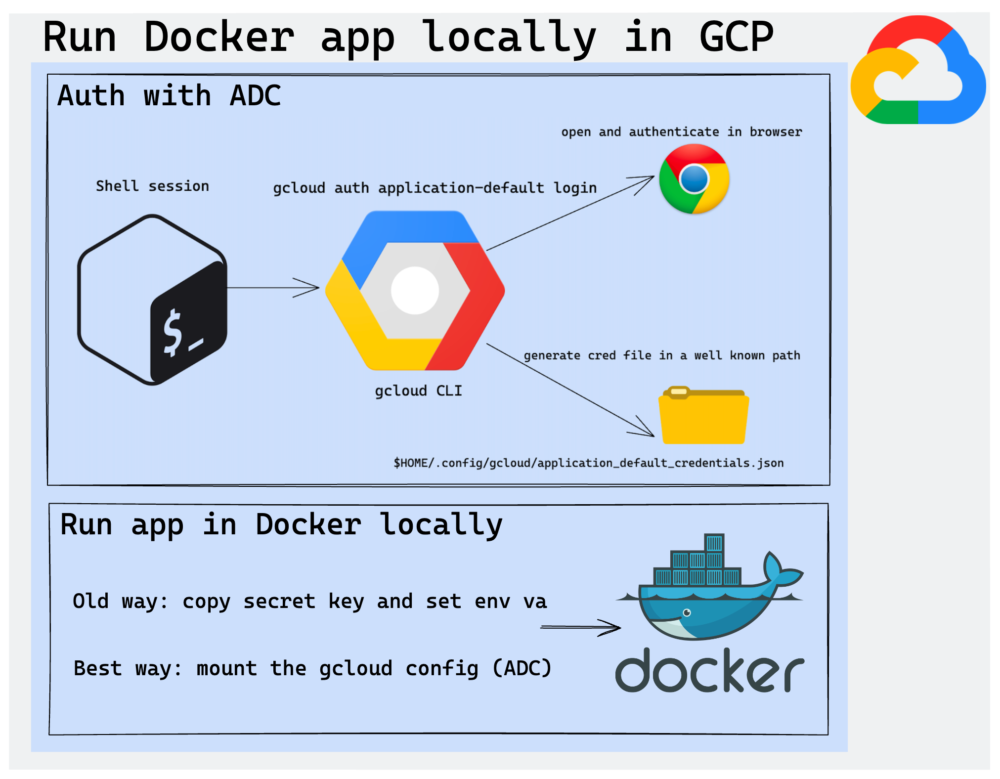

# docker-adc-keyless-gcp

🔐 GCP-Authenticated Docker Example
This module demonstrates how to run a Docker container locally while securely authenticating to Google Cloud using 
Application Default Credentials (ADC) — without embedding service account keys or tokens.

By mounting your local gcloud configuration into the container, the app can seamlessly access GCP services using your 
current user credentials (set via gcloud auth application-default login).

Ideal for development, demos, or prototypes where you want GCP access from Docker without managing static keys.



The video in English :

https://youtu.be/tBHENRLe_ms

The video in French :

https://youtu.be/Obq0V3TtjwI

## Build the Dockerfile locally

```bash
docker build -t world-cup-stats-app .
```

## Run the Dockerfile locally

```bash
docker run --rm \
    -e GOOGLE_CLOUD_PROJECT="gb-poc-373711" \
    -v $HOME/.config/gcloud:/home/worldcupstatsuser/.config/gcloud:ro \
    world-cup-stats-app
```
